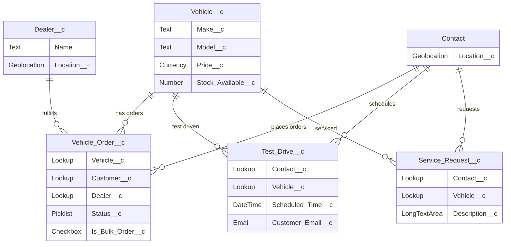

# Data Model Setup — WhatsNext Vision Motors

This guide provides step-by-step instructions to create all custom objects, fields, and relationships in your Salesforce org.

---

## 1. Vehicle (`Vehicle__c`)

### Create the Object
1. Go to **Setup → Object Manager → Create → Custom Object**.
2. Fill in:
   - **Label**: `Vehicle`
   - **Plural Label**: `Vehicles`
   - **Object Name**: `Vehicle`  (API Name becomes `Vehicle__c`)
   - **Record Name**: `Vehicle Name` (Data Type: Text)
3. Check **Allow Reports**, **Allow Activities**, **Track Field History**, **Allow Search**.
4. Under **Object-Level Help**, select the **Tab** option and choose a relevant icon (e.g., a car icon).  Click **Save**.
5. After saving, navigate to the object to create the Tab: **Setup → Tabs → New → Custom Object Tab → Vehicle__c**, select a tab style.

### Create Fields on `Vehicle__c`

| # | Field Label        | API Name              | Data Type      | Details                                     |
|---|--------------------|-----------------------|----------------|---------------------------------------------|
| 1 | Make               | `Make__c`             | Text(100)      | Required                                    |
| 2 | Model              | `Model__c`            | Text(100)      | Required                                    |
| 3 | Price              | `Price__c`            | Currency(16,2) | Required                                    |
| 4 | Stock Available    | `Stock_Available__c`  | Number(18,0)   | Default Value: `0`                          |

**Steps for each field:**
1. On the Vehicle object page, click **Fields & Relationships → New**.
2. Select the Data Type from the table above → **Next**.
3. Enter the Field Label and Field Name → configure length/decimal as stated → **Next**.
4. Set field-level security (visible to all profiles or as needed) → **Next → Save**.

---

## 2. Dealer (`Dealer__c`)

### Create the Object
1. **Setup → Object Manager → Create → Custom Object**.
2. Fill in:
   - **Label**: `Dealer`
   - **Plural Label**: `Dealers`
   - **Object Name**: `Dealer` (API Name: `Dealer__c`)
   - **Record Name**: `Dealer Name` (Text)
3. Enable Reports, Activities, Search. **Save**.
4. Create a **Tab** for this object.

### Create Fields on `Dealer__c`

| # | Field Label | API Name       | Data Type            | Details                       |
|---|-------------|----------------|----------------------|-------------------------------|
| 1 | Location    | `Location__c`  | Geolocation          | Decimal Places: 7, Display: Decimal |

> [!NOTE]
> The "Dealer Name" is already the Record Name field, so no separate Name field is needed.

**Geolocation Field Steps:**
1. **Fields & Relationships → New → Geolocation → Next**.
2. Field Label: `Location`, Field Name: `Location`.
3. Latitude and Longitude Decimal Places: `7`.
4. Set field-level security → **Save**.

> [!IMPORTANT]
> Geolocation fields create two sub-fields automatically:
> - `Location__Latitude__s`
> - `Location__Longitude__s`
>
> Use these sub-field API names when accessing coordinates in Apex or formulas.

---

## 3. Contact — Add Geolocation Field

We use the **standard Contact** object. Add a geolocation field to represent the customer's address coordinates.

### Create Field on `Contact`

1. **Setup → Object Manager → Contact → Fields & Relationships → New**.
2. Data Type: **Geolocation** → **Next**.
3. Field Label: `Location`, Field Name: `Location` (API Name: `Location__c`).
4. Decimal Places: `7`.
5. Set field-level security → **Save**.

---

## 4. Vehicle Order (`Vehicle_Order__c`)

### Create the Object
1. **Setup → Object Manager → Create → Custom Object**.
2. Fill in:
   - **Label**: `Vehicle Order`
   - **Plural Label**: `Vehicle Orders`
   - **Object Name**: `Vehicle_Order` (API Name: `Vehicle_Order__c`)
   - **Record Name**: `Vehicle Order Number` (Data Type: **Auto Number**, Format: `VO-{0000}`)
3. Enable Reports, Activities, Search. **Save**.
4. Create a **Tab** for this object.

### Create Fields on `Vehicle_Order__c`

| # | Field Label      | API Name             | Data Type          | Details                                          |
|---|------------------|----------------------|--------------------|--------------------------------------------------|
| 1 | Vehicle          | `Vehicle__c`         | Lookup(Vehicle__c) | Related To: Vehicle                              |
| 2 | Customer         | `Customer__c`        | Lookup(Contact)    | Related To: Contact                              |
| 3 | Dealer           | `Dealer__c`          | Lookup(Dealer__c)  | Related To: Dealer                               |
| 4 | Status           | `Status__c`          | Picklist           | Values: `Draft`, `Pending`, `Confirmed`. Default: `Draft` |
| 5 | Is Bulk Order    | `Is_Bulk_Order__c`   | Checkbox           | Default: Unchecked                               |

**Lookup Field Steps (repeat for each):**
1. **Fields & Relationships → New → Lookup Relationship → Next**.
2. Select the Related To object from the table → **Next**.
3. Enter Field Label and Field Name → **Next** through remaining steps → **Save**.

**Picklist Field Steps:**
1. **Fields & Relationships → New → Picklist → Next**.
2. Enter values one per line: `Draft`, `Pending`, `Confirmed`.
3. Check **Use first value as default value** → **Next → Save**.

---

## 5. Test Drive (`Test_Drive__c`)

### Create the Object
1. **Setup → Object Manager → Create → Custom Object**.
2. Fill in:
   - **Label**: `Test Drive`
   - **Plural Label**: `Test Drives`
   - **Object Name**: `Test_Drive` (API Name: `Test_Drive__c`)
   - **Record Name**: `Test Drive Name` (Text)
3. Enable Reports, Activities, Search. **Save**.
4. Create a **Tab** for this object.

### Create Fields on `Test_Drive__c`

| # | Field Label     | API Name              | Data Type            | Details                          |
|---|-----------------|-----------------------|----------------------|----------------------------------|
| 1 | Contact         | `Contact__c`          | Lookup(Contact)      | Related To: Contact              |
| 2 | Vehicle         | `Vehicle__c`          | Lookup(Vehicle__c)   | Related To: Vehicle              |
| 3 | Scheduled Time  | `Scheduled_Time__c`   | Date/Time            | Required                         |
| 4 | Customer Email  | `Customer_Email__c`   | Email                |                                  |

---

## 6. Service Request (`Service_Request__c`)

### Create the Object
1. **Setup → Object Manager → Create → Custom Object**.
2. Fill in:
   - **Label**: `Service Request`
   - **Plural Label**: `Service Requests`
   - **Object Name**: `Service_Request` (API Name: `Service_Request__c`)
   - **Record Name**: `Service Request Number` (Auto Number, Format: `SR-{0000}`)
3. Enable Reports, Activities, Search. **Save**.
4. Create a **Tab** for this object.

### Create Fields on `Service_Request__c`

| # | Field Label  | API Name           | Data Type          | Details                         |
|---|--------------|--------------------|--------------------|----------------------------------|
| 1 | Contact      | `Contact__c`       | Lookup(Contact)    | Related To: Contact              |
| 2 | Vehicle      | `Vehicle__c`       | Lookup(Vehicle__c) | Related To: Vehicle              |
| 3 | Description  | `Description__c`   | Long Text Area(32000) | Visible Lines: 6              |

---

## Summary — Entity Relationship Diagram

