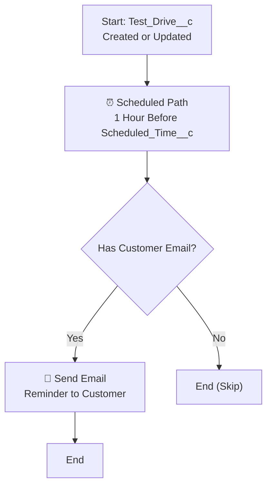

# Record-Triggered Flow — Test Drive Email Reminder

## Objective
Send an automated email reminder to the customer **24 hours before** their scheduled test drive time.

---

## Prerequisites
- The `Test_Drive__c` object exists with `Scheduled_Time__c` (Date/Time) and `Customer_Email__c` (Email) fields.
- An **Email Alert** or we will use a **Send Email** action inside the flow.

---

## Step-by-Step Configuration

### Step 1: Create the Flow

1. Go to **Setup → Flows → New Flow**.
2. Select **Record-Triggered Flow** → **Create**.

---

### Step 2: Configure the Start Element

1. **Object**: Select `Test Drive` (`Test_Drive__c`).
2. **Trigger the Flow When**: `A record is created or updated`.
3. **Condition Requirements**: `None` (run for all test drives).
4. **Optimize the Flow for**: Select **Actions and Related Records**.
5. Click **Done**.

---

### Step 3: Add a Scheduled Path

1. On the Start element, click **Add Scheduled Paths (Optional)** → **New Scheduled Path**.
2. Configure:
   - **Path Label**: `24 Hours Before Test Drive`
   - **API Name**: `X24_Hours_Before_Test_Drive`
   - **Time Source**: `Test_Drive__c.Scheduled_Time__c`
   - **Offset Number**: `1`
   - **Offset Options**: `Hours Before`

> [!IMPORTANT]
> The scheduled path evaluates against the **Scheduled_Time__c** field.
> If a record is created with a `Scheduled_Time__c` less than 24 hours away, the flow will run at the next evaluation interval (the platform checks every hour).

3. Click **Done**.

---

### Step 4: Add a Decision Element (Optional Validation)

On the Scheduled Path, add a **Decision** element to verify the email is populated:

1. Drag a **Decision** element onto the scheduled path canvas.
2. **Label**: `Has Customer Email?`
3. **Outcome 1**:
   - Label: `Email Exists`
   - Condition: `{!$Record.Customer_Email__c}` **Is Null** = `{!$GlobalConstant.False}`
4. **Default Outcome**: `No Email — Skip`
5. Click **Done**.

---

### Step 5: Add the Send Email Action

On the **Email Exists** outcome path:

1. Drag an **Action** element.
2. Search for and select **Send Email** (standard action).
3. Configure:

   | Parameter              | Value                                                                 |
   |------------------------|-----------------------------------------------------------------------|
   | **Email Addresses (To)** | `{!$Record.Customer_Email__c}`                                      |
   | **Subject**            | `Reminder: Your Test Drive is Tomorrow!`                              |
   | **Body (Plain Text)**  | See template below                                                   |

4. **Email Body Template:**
   ```
   Dear Customer,

   This is a friendly reminder that your test drive is scheduled for:
   {!$Record.Scheduled_Time__c}

   Please arrive 10 minutes early at the dealership. If you need to reschedule, please contact us.

   Thank you,
   WhatsNext Vision Motors Team
   ```
5. Click **Done**.

---

### Step 6: Save and Activate

1. Click **Save**.
   - **Flow Label**: `Test Drive Email Reminder`
   - **Flow API Name**: `Test_Drive_Email_Reminder`
2. Click **Activate**.

---

## Flow Diagram



> [!NOTE]
> **Scheduled Path Timing**: Salesforce evaluates scheduled paths approximately every hour. The email will be sent during the first evaluation that occurs at or after the 24-hour-before mark.

---

## Testing

1. Create a **Test Drive** record with:
   - `Scheduled_Time__c` = a date/time approximately **25 hours** in the future.
   - `Customer_Email__c` = your test email address.
2. Wait for the scheduled path to trigger (or use **Debug** in Flow Builder with a time-shift).
3. Verify the email arrives in your inbox.

> [!TIP]
> In a **sandbox**, use **Setup → Flows → find the flow → Pause/Resume** section to view scheduled interviews queued for processing.
